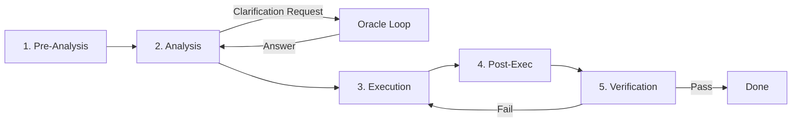

# @nexical/engine


> **Extensible AI-driven multi-agent planner and orchestrator.**
> The Engine acts as the cognitive runtime for your project, coordinating Agents, Skills, and Drivers to turn valid intent into concrete digital artifacts.

---

## 📖 Table of Contents

- [I. Overview](#i-overview)
- [II. Getting Started](#ii-getting-started)
- [III. Configuration](#iii-configuration)
- [IV. The .ai Directory](#iv-the-ai-directory)
- [V. Usage & API Reference](#v-usage--api-reference)
- [VI. Advanced Systems](#vi-advanced-systems)
  - [The Architect & Oracle System](#1-the-architect--oracle-system)
  - [The 5-Phase Skill Pipeline](#2-the-5-phase-skill-pipeline)
  - [The Evolution System](#3-the-evolution-system-long-term-memory)
  - [Signal Processing](#4-signal-processing--control-flow)
- [VII. Git Integration & Worktrees](#vii-git-integration--worktrees)
- [VIII. Skill Definitions](#viii-skill-definitions)
- [IX. Custom Drivers](#ix-custom-drivers)
- [X. Technical Architecture](#x-technical-architecture)
- [XI. Development & Contribution](#xi-development--contribution)
- [XII. Troubleshooting & Common Pitfalls](#xii-troubleshooting--common-pitfalls)
- [XIII. Testing & Simulation](#xiii-testing--simulation)
- [XIV. Deployment](#xiv-deployment)
- [XV. Housekeeping](#xv-housekeeping)

---

## I. Overview

**@nexical/engine** is a TypeScript-based runtime that enables sophisticated multi-agent AI workflows. Unlike simple chat bots, this engine is designed for **stateful, multi-turn, and goal-oriented** operations. It provides the backbone for building AI systems that can plan, architect, and execute complex coding and content generation tasks.

### Key Features

- **Orchestrator-First Design**: A central `Orchestrator` manages the entire lifecycle, acting as the bridge between your host application (CLI/UI) and the AI agents.
- **Provider-Agnostic Drivers**: Interface-based driver system (`IDriver`) allowing you to swap backend LLMs (Gemini, OpenAI, Local) without changing business logic.
- **Declarative Skills**: Define capabilities in simple YAML files (`*.skill.yaml`) ensuring clean separation of prompt logic and code.
- **Session Persistence**: All state is persisted to disk (`.ai/state.yml`), allowing workflows to pause, resume, and survive crashes.

---

## II. Getting Started

### Prerequisites

- **Node.js**: v18.0.0 or higher
- **npm**: v9.0.0 or higher

### Installation

```bash
npm install @nexical/engine
```

### Quick Start

The correct way to use the engine is via the `Orchestrator`. You must implement a `RuntimeHost` to bridge the engine to your environment (CLI or Web).

```typescript
import { Orchestrator, IRuntimeHost } from '@nexical/engine';

// 1. Implement Host
const myHost: IRuntimeHost = {
  log: (l, m) => console.log(`[${l}] ${m}`),
  status: (s) => console.log(`STATUS: ${s}`),
  ask: async (q) => 'User Input',
  emit: (e, d) => {},
};

// 2. Initialize
const orchestrator = new Orchestrator(process.cwd(), myHost);
await orchestrator.init();

// 3. Run
await orchestrator.start('Refactor the login service');
```

---

## III. Configuration

The engine uses a hierarchical configuration system, primarily driven by `.ai/config.yml`.

### Configuration File (`.ai/config.yml`)

The `ProjectConfigurationSchema` defined in `src/domain/Project.ts` allows the following:

```yaml
# .ai/config.yml
git:
  submodules: true # Allow managing git submodules
max_worktrees: 5 # Max concurrent worktrees for task isolation
agents:
  architect:
    driver: 'gemini' # Force specific driver
```

### Environment Variables

Drivers execute underlying binaries (e.g., `gemini` CLI). Your environment must have the necessary variables set for _those tools_ to work.

| Variable Name    | Description                       |
| :--------------- | :-------------------------------- |
| `GEMINI_API_KEY` | API Key for underlying Gemini CLI |
| `OPENAI_API_KEY` | API Key for OpenAI CLI            |

---

## IV. The .ai Directory

The `.ai/` directory is the brain of your project. It contains configuration, persistent state, custom skills, and communication buffers.

### File Breakdown

| Path             | Purpose                                                                                                                                                                                            | Format |
| :--------------- | :------------------------------------------------------------------------------------------------------------------------------------------------------------------------------------------------- | :----- |
| `.ai/config.yml` | **Project Configuration**. Defines agent behaviors, git settings, and concurrency limits.                                                                                                          | YAML   |
| `.ai/state.yml`  | **Session State**. The "Saved Game" file. Contains the current status (IDLE/PLANNING), the active plan, completed tasks, and history. Deleting this resets the AI's memory of the current session. | YAML   |
| `.ai/log.yml`    | **Evolution Log**. A structured log of major decisions, architecture changes, and signals. Useful for auditing AI behavior over time.                                                              | YAML   |

### Directory Breakdown

#### 1. `.ai/prompts/`

A **Template Library** for Skill prompts. While the core Agents now use Skill definitions (`.skill.yaml`), they use the `PromptEngine` which searches this directory for **Nunjucks includes**.

- **Purpose**: Store reusable prompt fragments or large templates used by `` within Skill YAMLs.
- **Deprecation Note**: Specific files like `architect.md` and `planner.md` are legacy placeholders and no longer used as primary system prompts; their logic now resides inside the default skills.

#### 2. `.ai/skills/`

The registry of capabilities. Any `*.skill.yaml` file placed here is automatically loaded by the `SkillRegistry`.

- Use this to add project-specific tools (e.g., `deploy.skill.yaml`).
- See [Skill Definitions](#vii-skill-definitions) for syntax.

#### 3. `.ai/drivers/`

The registry of custom drivers. Any compiled `*Driver.js` file here is loaded by the `DriverRegistry`.

- Use this to add support for local tools or private APIs.
- See [Custom Drivers](#viii-custom-drivers) for implementation details.

#### 4. `.ai/architecture/`

Stores the high-level design artifacts generated by the Architect Agent.

- `current.md`: The authoritative "Architecture Document" for the project. The AI refers to this to understand the system boundaries and design patterns.

#### 5. `.ai/plan/`

Stores the execution plan generated by the Planner Agent.

- `current.yml`: The Directed Acyclic Graph (DAG) of tasks currently being executed.

#### 6. `.ai/comms/` (Inbox/Outbox)

The filesystem-based message bus used for inter-agent communication and task delegation.

- `inbox/`: Tasks or Sub-Agents write request files here (`req_*.json`).
- `outbox/`: The Architect or Planner writes response files here (`res_*.json`).

#### 7. `.ai/archive/`

When a session is fully reset or a major refactor is completed, old state files and logs may be moved here for historical reference.

---

## V. Usage & API Reference

### Core Concepts

- **Orchestrator**: The main entry point. It owns the `Project`, `Brain`, `Session` and `Workspace`.
- **Workflow**: The Finite State Machine (FSM) that drives execution loop.

### Common Use Cases

#### 1. Running a One-Off Command

```typescript
await orchestrator.execute('Analyze the src/utils directory');
```

#### 2. Listening to Events

```typescript
orchestrator.on('state:enter', (data) => console.log(data));
orchestrator.on('signal', (data) => console.log(data));
```

---

## VI. Advanced Systems

Typical usage involves calling `orchestrator.start()`. However, understanding the internal mechanisms is crucial for advanced integration and debugging.

### 1. The Architect & Oracle System

The **Architect** is the only agent with direct access to the User via the `RuntimeHost`. Other agents (Planner, Tasks, Sub-Agents) are isolated and must "ask the Oracle" (the Architect) if they need clarification.

#### Architecture of Communication

This decoupled communication is handled by the `FileSystemBus` in `.ai/comms/`.

1.  **Request**: An isolated agent (e.g., a Task running in a subprocess) needs to ask "Which database schema should I use?". It writes a `req_*.json` file to `.ai/comms/inbox/`.
2.  **Oracle Mode**: The Architect runs in `OracleMode` (via `ArchitectAgent.runOracleMode`), watching the `inbox` via `chokidar`.
3.  **Processing**: The Architect detects the file, reads the `Signal`, and typically calls `host.ask()` to prompt the real human user.
4.  **Response**: The Architect writes a `res_*.json` file to `.ai/comms/outbox/`.
5.  **Unblocking**: The original agent, which was polling the outbox, detects the response and resumes execution.

**Why this matters**: This design enables **asynchronous, multi-process** agent architectures where agents don't share memory but can still query the user via a centralized "Source of Truth".

### 2. The 5-Phase Skill Pipeline

Every Skill defined in the system undergoes a rigorous 5-step lifecycle, orchestrated by the `Skill` class. This ensures robustness and self-correction.



1.  **Pre-Analysis**: Runs environment setup commands (e.g., `git checkout`, `npm install`). Defined in `pre_analysis_commands`.
2.  **Analysis (The Thinking Phase)**:
    - The specialized `analysis` driver runs first.
    - It evaluates the task and context.
    - **Clarification Loop**: If the driver is unsure, it returns a `CLARIFICATION_NEEDED` signal. The engine pauses, asks the Oracle (User), injects the answer into the context, and re-runs the Analysis phase.
3.  **Execution (The Doing Phase)**:
    - The `execution` driver performs the core work (e.g., writing code, generating text).
4.  **Post-Execution**: Runs cleanup or formatting commands (e.g., `npm run format`).
5.  **Verification (The Checking Phase)**:
    - **Validators**: Injected code-based checks (e.g., `PlanGraphValidator` ensures the DAG is valid).
    - **Verification Driver**: An optional AI pass to review the output of the Execution phase.
    - **Retry Loop**: If verification fails, the pipeline loops back to **Execution** (not Analysis) with the error feedback, up to `max_retries`.

### 3. The Evolution System (Long-Term Memory)

The engine maintains an **Evolution Log** (`.ai/log.yml`) that records critical failures and architectural pivots.

- **Purpose**: To prevent the AI from repeating mistakes ("Strategic Loop Detection").
- **Mechanism**:
  1.  When a `FAIL`, `REPLAN`, or `REARCHITECT` signal occurs, `EvolutionService` records it.
  2.  This log is **injected into the Architect's prompt** on subsequent runs.
  3.  The Architect sees: "Attempt 1 failed because X. Do not do X again."

### 4. Signal Processing & Control Flow

The Engine uses **Signals** (`Signal.ts`) as its primary control flow mechanism, essentially "Exceptions as Logic".

- **Happy Path**: `Signal.NEXT` or `Signal.COMPLETE`. Move to the next state or task.
- **Wait**: `Signal.WAIT`. Pause execution until an external event (like a file appearance).
- **Failure**: `Signal.FAIL`. Explicit failure of a task.
- **Replanning**: `Signal.REPLAN`. A profound signal indicating the current plan is invalid. The Workflow catches this, transitions back to the **Planning** state, and regenerates the task graph based on new constraints.

**The Workflow Loop (`Workflow.ts`):**
The `Workflow` class runs an infinite loop that:

1.  Enters a State (e.g., `ExecutingState`).
2.  Runs the State logic.
3.  **Catches Signals**: If a State throws a Signal (e.g., `REPLAN`), the Workflow catches it.
4.  **Transitions**: It consults the `WorkflowGraph` to determine the next State based on the Signal.
    - `EXECUTING` + `REPLAN` -> `PLANNING`
    - `PLANNING` + `FAIL` -> `FAILED`
5.  **Persists**: Every signal and state change is written to `.ai/state.yml`.

---

## VII. Git Integration & Worktrees

The Engine is uniquely designed to safely modify your codebase by treating **Git as a transactional filesystem**. It avoids modifying the user's working directory directly during dangerous operations.

### 1. Safety & Isolation Model

When the **Executor** processes a task (e.g., "Refactor the login service"), it does NOT touch your current working files. Instead, it creates a temporary **Git Worktree**.

1.  **Worktree Creation**: A new directory is created in `.worktrees/<task-id>/`.
2.  **Branching**: A dedicated branch `task/<task-id>` is checked out from the base branch.
3.  **Hydration**: The environment is prepared based on the Skill's `worktree_setup` configuration (e.g., `npm install`).
4.  **Execution**: The Code Agent runs strictly within this isolated directory. It can edit files, compile code, and run tests without breaking your main IDE session.

### 2. Task Branching & Merging

Only if the task completes **successfully** (including passing validation tests) will the engine attempt to merge the changes.

- **Success**: The `task/<task-id>` branch is merged back into your active branch (e.g., `main`).
- **Failure**: The worktree is discarded, and the branch is left for debugging or deleted (depending on config).
- **Conflict**: If a merge conflict occurs, the engine pauses and alerts the user to resolve it manually.

### 3. Environment Hydration

To ensure the isolated worktree is functional, you can configure "Hydration" steps in your Skill YAML.

```yaml
# .ai/skills/refactor.skill.yaml
worktree_setup:
  - 'cp .env.test .env' # Use test credentials
  - 'npm ci' # Install dependencies fresh
hydration:
  - 'node_modules' # Or simply copy node_modules to save time
```

This ensures that the agent has a fully working environment (compilers, linters) available in the sandbox.

---

## VIII. Skill Definitions

Skills are the atomic units of capability in the engine. They are defined declaratively in YAML files (ending in `.skill.yaml`).

```yaml
# .ai/skills/example.skill.yaml
name: 'my-skill'
description: 'A description of what this skill does.'
execution:
  provider: 'gemini'
  prompt_template: |
    Task: {{ user_request }}
    Context: {{ task_context }}
```

### Prompt Templating

The `prompt_template` field supports **Nunjucks** templating.
Variables: `user_request`, `task_id`, `task_prompt`, `params`.

---

## IX. Custom Drivers

Drivers are the executable layer of the engine.

### 1. The `IDriver` Interface

To build a driver, implement the `IDriver` interface (or extend `BaseDriver`).

```typescript
export interface IDriver<TContext = ISkillContext> {
  name: string; // Unique identifier (used in 'provider' field of Skill YAML)
  isSupported(): Promise<boolean>;
  execute(config: DriverConfig, context?: TContext): Promise<Result<string, Error>>;
}
```

### 2. Registering Your Driver

Place your compiled `.js` driver file in `.ai/drivers/`. The `DriverRegistry` will auto-load it.

---

## X. Technical Architecture

### Tech Stack

- **Language**: TypeScript 5.0+
- **Runtime**: Node.js (ES Modules)
- **Testing**: Jest
- **Validation**: Zod (Schema Validation)

### System Diagram

```mermaid
graph TD
    User[User / CLI] --> Orch[Orchestrator]
    Orch --> Session[Session]
    Session --> Workflow[Workflow Engine]

    subgraph "Advanced Execution"
        Workflow --> |Signal Loop| State[Engine State]
        Workflow --> |Delegate| Brain
    end

    Brain --> Architect[Architect (Oracle)]
    Brain --> Planner

    subgraph "Comms"
        Planner --> |Req| Inbox[.ai/comms/inbox]
        Inbox --> Architect
        Architect --> |Res| Outbox[.ai/comms/outbox]
        Outbox --> Planner
    end
```

---

## XI. Development & Contribution

We welcome contributions! Please refer to **[CODE.md](./CODE.md)** for strict coding standards before submitting a PR.

---

## XII. Troubleshooting & Common Pitfalls

### 1. "Signal Loop Detected"

- **Symptom**: The engine aborts with `Maximum retry limit reached`.
- **Cause**: The Planner or Architect is generating the same failing plan repeatedly.
- **Fix**: Check `.ai/log.yml`. If the AI isn't learning, ensure your `Architect` skill prompt actually includes `{{ evolution_log }}`.

### 2. "Git Worktree Locked"

- **Symptom**: `git worktree add` fails.
- **Cause**: A previous run crashed before cleanup.
- **Fix**: Run `git worktree prune` manually. The engine attempts this on startup, but aggressive locks may require manual intervention.

### 3. Driver Timeouts

- **Symptom**: `GeminiDriver` throws specific timeout errors.
- **Fix**: Increase the timeout in your driver config or split the task into smaller sub-tasks.

---

## XIII. Testing & Simulation

For developers extending the engine, we recommend a **Fixture-based approach**.

```typescript
import { ProjectFixture } from '@nexical/engine/test-utils';

const fixture = new ProjectFixture();
await fixture.setup(); // Creates temp dir with git init

// Mock a driver to avoid real API costs
fixture.registerMockDriver('gemini', async (skill) => {
  return Result.ok('Mocked AI Response');
});

const orchestrator = await fixture.initOrchestrator();
await orchestrator.start('Test Task');
```

---

## XIV. Deployment

This engine is typically deployed as an npm package dependency within a larger CLI tool or Host Application.

```bash
npm run build
```

---

## XV. Housekeeping

### License

This project is licensed under the **Apache-2.0** License. See the [LICENSE](./LICENSE) file for details.

### Authors

- **Adrian Webb** - _Initial Work_
